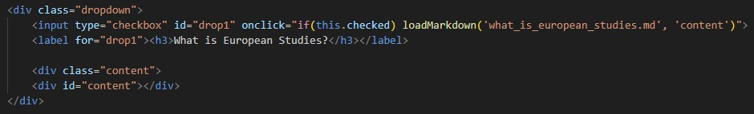

HTML Structure

For my website, I decided to have a landingpage that links to the other two pages with content, meaning I’d have to use 3 different HTML files. All of them however have a very similar structure:
header: short introduction
body: markdown files that are being loaded with JavaScript 
button: used to go to the different pages (explained in another section)

My HTML Structure is almost entirely based on the course material found on Brightspace. 
I first loaded the default structure using ! and TAB. I then also added a line with 

> < link rel="stylesheet" href="styles2.css"> 

to link my HTML to my CSS file and a line with 

> < script src="https://cdn.jsdelivr.net/npm/marked/marked.min.js"></script> 

to use JavaScript functions on my website. After that, I also changed the title of my page. I repeated this for all 3 HTML files. 
Example: 

Then, starting with the landingpage, I added a header, which includes a short welcome and introduction to the website. Another thing I decided to add here is the random advice API, but more on that in the section below. The rest of the landingpage pretty much only includes the buttons, which are also explained in another section below. In the other two HTMLs, however, I added multiple JavaScript functions to include my content in the form of markdown files. For that, I copied and adjusted the function provided on Brightspace, meaning first pasting the general function into my < script> part, and then adding another one in the body where I want it to be loaded. I decided I wanted to make this part a bit more fun and interactive, so I used ChatGPT to design them as dropdowns that reveal the text when clicked. For that, I created an invisible “checkbox” with a label that, when clicked, activates the loadMarkdown function. This is what one dropdown would look like in HTML: 

This step was then repeated for all the markdown files that belong on each page. The "explanation" and "assignment" pages also both contain a button which redirects you back to the landingpage. 
