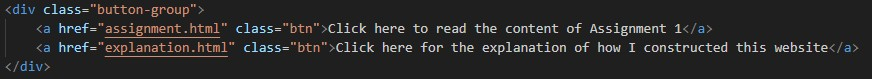
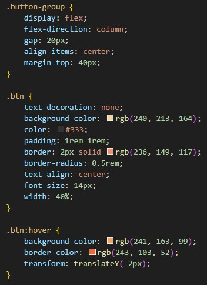

To create the buttons I first looked at the course material and the exercises we did in class. There I found a button which loads markdown files, but I wanted to experiment a bit and make my buttons redirect you to different parts of the page. So I went for a quick google search and found this guide on [stackoverflow.com](https://stackoverflow.com/questions/2906582/how-do-i-create-an-html-button-that-acts-like-a-link) which gave me this structure to work with: 

> < a href="*link*" class="btn"> *text* < /a>

Instead of a link, I added the name of the HTML file I want the button to redirect you to and added appropriate text. The class tag is important so I can style the button in CSS later. Since my landingpage has two buttons, I also added the class "button-group" to make it easier to place and style them on my website. This is what the two buttons on my landingpage look like:

For the styling in CSS, I found a [reddit thread](https://www.reddit.com/r/html5/comments/u7o29l/how_to_create_a_button_that_works_as_a_link_to) by user u/rapidtab. The reply by user u/ole1993 gave an example of how to style buttons, with which i played around and adjusted it a bit to my liking. I copied his basic structure for the button, adjusted the colors and paddng, and added a border, changed the width and text size a bit until I was happy with the result. For that I mainly hosted the website locally on my PC and inspected the page elements where I could make and see the adjustments until I was happy. Here is the final CSS styling:

