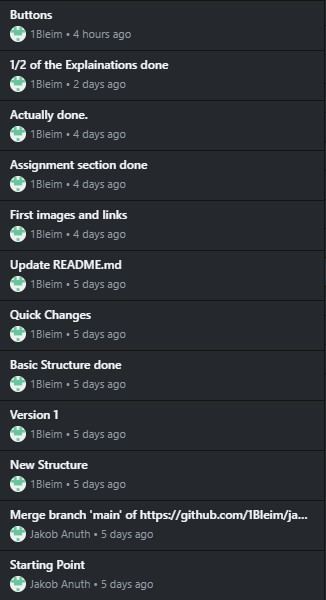

# Using GitHub

When starting out this project, I first created a depository on GitHub. This is mainly because I really enjoy having the Version Control feature. I added all the files for my basic structure into a folder on my computer and commited them to my GitHub profile. Every time I worked on my website and made major changes, I would commit them using GitHub Desktop. This is what my History looks like shortly before finishing the project: 

I uesd this to keep track over the most important changes and also always included checklists and to-do lists in the description so I would not forget them later on. 

Another thing I did on GitHub was publish my depository on GitHub Pages which allows you to see and use the website without hosting it yourself. The website can be accessed on [this link](https://1bleim.github.io/jakob-anuth-exam-website).